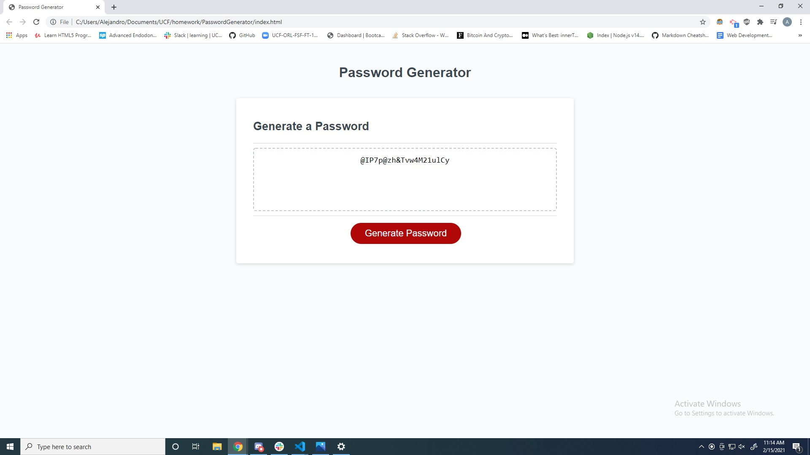

# PasswordGenerator

## Preview

## Description

The purpose of this excercise was to create a dynamic password generator based on the user's input using javascript. The user must select atleast one parameter for the password, and a minimum string length to be able to generate a password.

## Table of Contents 
* [Installation](#installation)
​
* [Usage](#usage)
​
* [License](#license)
​
* [Contributing](#contributing)
​
* [Tests](#tests)
​
* [Questions](#questions)
​
## Installation

​To install necessary dependecies please use the following commands:

	None
	
## Usage
​
N/A
​​
## License
MIT
	

## Contributing
​
You may not contribute to the repo at this time.
​
## Tests
​
none

## Questions
​
If you have any questions, comments, or concerns please feel free to contact me at castroal96@gmail.com or on Github: [CastroAlejandro](https://github.com/CastroAlejandro).
